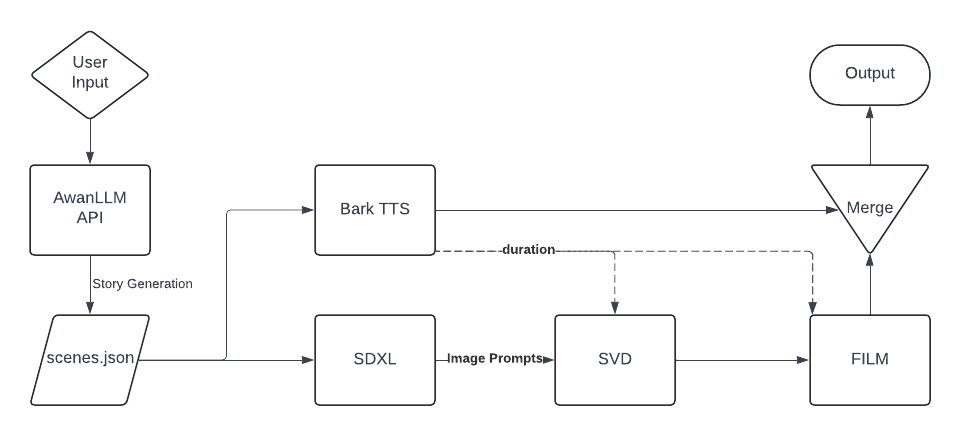

# AI Story Maker

 AI Story Maker is an AI-powered tool that generates stories with multiple scenes, accompanied by images and videos. 
 
 The user provides a prompt, then LLAMA writes the story, Stable DIffusion XL generates images which are feed to Stable Video Diffusion to create videos, while Suno Bark narrates the story. Lastly, FILM interpolates the generated videos by adding more frames.


## Usage

### Prerequisites

The program interacts with [AwanLLM API](https://www.awanllm.com/) for story generation. Provide your API key in __secret.json__ before story generation. 

Without the API key, the program is unable to generate stories. However, other functions such as image generation, video generation are still available. Modify __scenes.json__ to use the program without the API key.

### Python

Interface AI story maker with Python code. Simply provide a prompt that follows "Write me a story about..."
```python
from StoryMaker import *

prompt = ''
sm = StoryMaker(prompt)
```

Then run each of the following commands.

```python
sm.generate_story()
```
generate_story create __scenes.json__, where the script, SDXL prompts, and file names are stored. 

```python
sm.generate_images()
sm.generate_speech()
sm.generate_video(fps=3)
sm.compile_story(3, 'movie.mp4')
```
The output video is named movie.mp4 by default. The functions are segmented due to the VRAM issue that is further explained below. 


## Known Issues

GPU memory remain allocated to diffusion pipelines even after the process is finished. Running commands such as `cuda.clear()` and `cuda.get_current_device().reset()` clears GPU memory but also causes unrecoverable changes to the CUDA context, rendering other diffusion pipelines unusable. 

The "solution" is to run each class function individually and save the progress files. 

## Acknowledgments

* [Stable Diffusion XL](https://huggingface.co/stabilityai/stable-diffusion-xl-base-1.0)

* [Stable Video Diffusion Image-to-Video Model](https://huggingface.co/stabilityai/stable-video-diffusion-img2vid-xt)

* [Bark: Text-Prompted Generative Audio Model](https://huggingface.co/suno/bark)

* [FILM: Frame Interpolation for Large Motion](https://github.com/google-research/frame-interpolation)

## License

Distributed under the MIT License. See `LICENSE` for more information.

<p align="right">(<a href="#readme-top">back to top</a>)</p>


